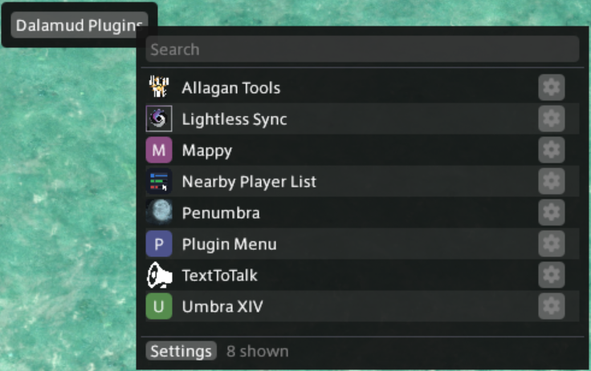

# Plugin Menu

A Dalamud plugin for FINAL FANTASY XIV. It puts a small floating button on screen
that opens a searchable list of every plugin you have installed, with each one's
window and settings a single click away.

The point is to skip the trip through `/xlplugins`, Installed Plugins, search, expand
the entry, and then finally the button.



## Features

- A floating button that opens the menu. It can be labelled whatever you like, moved
  with Shift and drag, or turned off entirely and driven from `/pmenu`.
- The list is built fresh every time the menu opens, so a plugin you just installed is
  there without a restart.
- One row per plugin with its icon, its name, and a cog for settings. Clicking the
  name opens the plugin.
- A search box, focused as soon as the menu opens.
- The list scrolls, so it does not matter how many plugins you have.
- Any plugin can be hidden from the menu and brought back later.
- Buttons at the bottom for Dalamud's own plugin installer and settings windows, so
  the menu covers everything you would have typed `/xlplugins` for.
- Plugin names are tidied for display, so a trailing version number or a
  `(testing)` marker does not take up half the row.

## Installing

The plugin is distributed through my custom Dalamud repository.

1. Type `/xlsettings` in game.
2. Open the **Experimental** tab.
3. Paste this into the empty box under **Custom Plugin Repositories**:

   ```
   https://raw.githubusercontent.com/joshua88wa/FFXIV/main/Dalamud/repo.json
   ```

4. Press **+**, make sure the checkbox next to it is on, then press **Save and Close**.
5. Open `/xlplugins`, search for Plugin Menu, and install it.

If nothing shows up, press the refresh icon at the top left of the plugin installer.

Other plugins in the same repository are listed at
[joshua88wa/FFXIV](https://github.com/joshua88wa/FFXIV).

## Commands

- `/pmenu` opens the menu
- `/pmenu config` opens the settings window
- `/pmenu button` shows or hides the floating button

## Settings

### Button

- Show the floating button. With it off, `/pmenu` still opens the menu.
- Button label
- Lock button position. Locking also removes the frame behind the button and stops it
  taking clicks anywhere except on the button itself, so it can sit on top of the HUD
  without eating anything.
- Scale

### Menu

- Menu width and height. Height is the point at which the list starts to scroll; a
  short list is still drawn short.
- Show the search box
- Show plugin icons
- Tidy up plugin names
- Only list plugins that have a window
- Close the menu after opening a plugin
- What clicking a row does: open the plugin, or open its settings

### Plugins

Every installed plugin, with a tick for whether it appears in the menu. Plugins that
are being left out by the "only list plugins that have a window" rule are still listed
here, greyed, with the reason. There is a count at the top and a search box, plus
buttons to show or hide everything at once.

### Other

- Clear the icon cache, which makes the icons download again
- Reset all settings to defaults, held behind Ctrl

## Notes

**The list** is `IDalamudPluginInterface.InstalledPlugins`, filtered to plugins that
are actually loaded. Opening one calls Dalamud's own `OpenMainUi` or `OpenConfigUi`
for that plugin, deferred to the next framework tick so it does not run in the middle
of this plugin's own drawing.

**Plugins with no window** are left off the list by default. `HasMainUi` and
`HasConfigUi` only tell you whether a plugin subscribed to Dalamud's open-window
events, and plenty of useful plugins never do: some run entirely in the background,
and some draw on top of a game window when one is open. Those plugins have nothing for
this menu to open, but they are still listed on the Plugins tab so it is clear what is
being left out and why.

**Icons** come from each plugin's manifest, which is a URL rather than a file on disk.
Dalamud downloads those for its own plugin installer but does not share that cache, so
this plugin fetches them once and keeps them in its own config folder. Until an icon
arrives, or for a plugin that has none, a coloured initial is drawn instead. One
attempt per plugin per session, so a dead link does not get retried endlessly.

**The row layout** shows a button only for the action that clicking the row does not
already do, and only when the plugin has both a window and a settings window. A row
that can do one thing does not need a button offering that same thing. Right clicking
a row lists everything explicitly, including hiding it.

**Name tidying** strips a trailing version number and markers like `(testing)` from
the display name only. It requires a dot in a bare number, so a plugin genuinely named
something like "Thing 2" keeps its name, and the untouched name is always in the
tooltip.

## Problems and suggestions

Open an issue:
[github.com/joshua88wa/FFXIV-Dalamud-PluginMenu/issues](https://github.com/joshua88wa/FFXIV-Dalamud-PluginMenu/issues)

## Credits

Umbra has a Plugin List toolbar widget that does something similar, and using it is
what prompted this. No code from it is used here.

Written with the help of an LLM, in case that matters to you.

## Building

Needs the .NET 10 SDK and an XIVLauncher install, which is where the Dalamud reference
assemblies come from.

```
cd PluginMenu
dotnet build -c Release
```

The build lands in `PluginMenu/bin/Release/`, with a packaged `latest.zip` alongside
it.

## License

[0BSD](LICENSE). Do whatever you want with it. No attribution, no notice to carry
around, no conditions at all. The license text is there to say the software comes with
no warranty, and nothing else.
